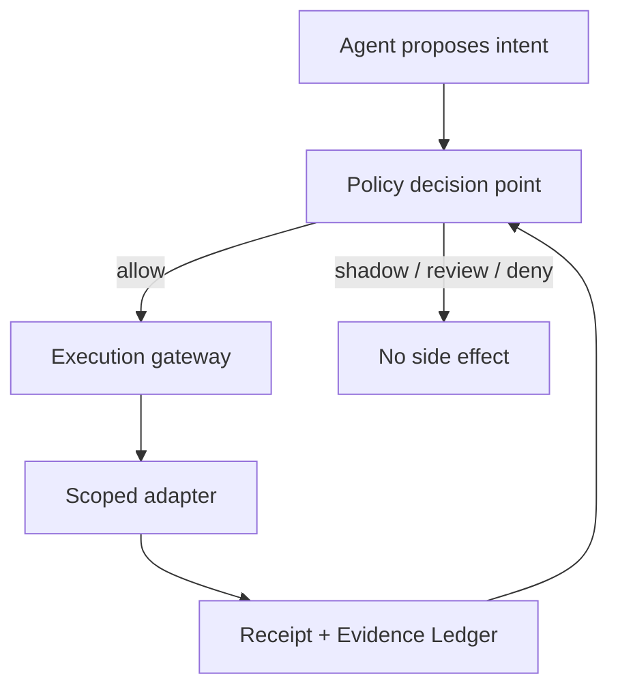

# Architecture Decision: Capability-Leased Autonomy

**Status:** Accepted for the first control-plane implementation
**Decision:** Treat autonomy as a revocable lease for one capability in one
context, never as a blanket rank held by an agent or Venture Cell.

## Verdict

The proposed 0–4 ladder is a useful operator display, but it is not safe enough
to be the authorization model. A cell that is excellent at support routing has
not thereby earned authority to change pricing, transfer funds, or enter a new
jurisdiction.

The strongest architecture is:

1. a deterministic policy decision point;
2. short-lived, least-privilege capability grants;
3. one policy-enforced gateway for side effects;
4. separate commercial and control-assurance evidence lanes;
5. automatic regression and pause, but independent human promotion;
6. a hash-chained Evidence Ledger; and
7. infrastructure controls that prevent agents from bypassing the gateway.

This repository implements the first six as a working vertical slice. The
seventh requires deployment-level identity, credential-broker, network-egress,
and database controls and remains a release gate.

## Decision frame

| Item | Decision input |
| --- | --- |
| Outcome | Operate digital ventures with the greatest practical autonomy that preserves bounded loss, auditability, and human authority over material decisions. |
| Baseline | Rule matches can currently mutate the knowledge graph and notify roles directly. There is no cell-scoped authorization or evidence-backed promotion mechanism. |
| Non-negotiables | Default deny; no self-promotion; no raw broad credentials; hard budget and scope caps; rapid pause; human/dual control for material actions. |
| Primary control point | The side-effect boundary: the last point before an action changes money, data, systems, customer state, or legal/reputational exposure. |
| Decisive unknown | The complete inventory of production side-effect paths and credentials that could bypass the gateway. |

## Strategic Tree Search

Scores are comparative design judgments, not measured probabilities. They use
the skill's weighted criteria: upside, causal fit, adoption, time to proof,
capital efficiency, durability, reversibility, and expansion value.

| Branch | Mechanism | Score / 100 | Confidence | Fatal risk | Disposition |
| --- | --- | ---: | --- | --- | --- |
| Cell-wide 0–4 ladder | Promote the whole cell after aggregate evidence. | 62 | Medium | Success in one workflow silently expands unrelated privileges. | Reject as authorization; retain only as a UI summary. |
| Human approval for every action | Keep all side effects in a review queue. | 58 | High | Review fatigue becomes both the speed bottleneck and a safety failure mode. | Retain only for material or novel actions. |
| Isolated high-autonomy sandbox | Give a cell broad freedom inside a technical sandbox. | 73 | Medium | External tools, credentials, and customer contact pierce the sandbox boundary. | Use as defense in depth, not the authority model. |
| Confidence-driven self-promotion | Let model confidence or internal simulation raise authority. | Rejected | High | Fails the external-evidence and independent-control hard gates. | Prohibited. |
| **Capability leases + execution gateway** | Authorize one action/resource/context envelope, then enforce at the side-effect boundary. | **91** | Medium-high | An unmediated credential or adapter can bypass the gateway. | **Selected.** |

### Strongest counterargument

The selected path introduces policy objects, grant lifecycle, approval binding,
ledger operations, and adapter migration before it creates customer value. A
poorly designed control layer can become ceremony that agents route around.

The answer is a narrow integration rule: analysis and proposals remain cheap;
only consequential side effects cross the gateway. Default execution remains
proposal-only until a workflow has a registered action definition, a scoped
grant, a trusted adapter, and objective assurance evidence. This concentrates
governance cost where the downside exists.

## Winning architecture

The policy decision uses independently registered action risk—not an agent's
risk label—and checks cell status, charter, active grant, resource scope,
parameter constraints, context fingerprint, data and geography scope, aggregate
budgets, expiry, and approvals. Unknown actions fail closed.

## Key design corrections

### Business proof does not buy operational authority

Customer payments, retention, and unit economics determine whether a venture
deserves more capital. They do not prove that an agent executes safely. A
promotion needs a separate assurance lane: representative trials, incident
rate, audit completeness, rollback drills, red-team results, and unchanged
model/prompt/tool/data context.

### Upgrades and downgrades are asymmetric

- Upgrade: one stage at a time, independent root-human decision, fixed policy
  criteria, intact evidence chain, and exact context match.
- Downgrade: immediate and automatable after incidents, drift, budget pressure,
  expired evidence, or context change.
- Critical incident: pause the cell. Resume remains a root-human action.

### Child authority is a strict subset

A child grant must narrow resource, time, stage, data, geography, parameters,
budget, or delegation depth. Material authority is not delegable. This prevents
an agent from creating a broader or more persistent agent through indirection.

## Standards grounding

This design is informed by, but does not claim certification or compliance
with:

- [NIST AI RMF Core](https://airc.nist.gov/airmf-resources/airmf/5-sec-core/),
  which treats GOVERN as a cross-cutting function and calls for documented,
  monitored accountability and risk processes.
- [NIST SP 800-207, Zero Trust Architecture](https://csrc.nist.gov/pubs/sp/800/207/final),
  which removes implicit trust based on location and emphasizes resource-level,
  policy-driven access decisions.
- [OWASP LLM06:2025 Excessive Agency](https://genai.owasp.org/llmrisk/llm062025-excessive-agency/),
  which recommends minimizing extensions, functionality, permissions, and
  autonomy and requiring authorization in downstream systems.
- [NIST NCCoE AI Agent Identity and Authorization](https://www.nccoe.nist.gov/projects/software-and-ai-agent-identity-and-authorization),
  a 2026 draft project focused on distinct agent identity, authorization, and
  accountability. It is useful direction, not a final standard.

If a use case falls under a regulated or high-risk regime, its separate legal
and compliance analysis remains mandatory; this control plane alone does not
establish compliance.

## Truth ledger

| Type | Statement |
| --- | --- |
| Verified repository fact | The pre-change rule engine called mutation/notification methods directly. |
| Verified implementation fact | Current controlled actions fail closed without a gateway, active grant, matching context, and registered adapter. |
| User-provided doctrine | Authority must be evidence-gated, Venture Cells isolated, constitutional controls persistent, and material actions human-controlled. |
| Inference | The gateway is the highest-leverage software control point because all consequential paths can be forced through one decision boundary. |
| Assumption | Production deployment can remove raw external credentials from agent runtimes and give them only gateway-scoped identities. |
| Unknown | How many side-effect paths outside `DecisionEngine` exist in production integrations. |
| Falsifier | If a material side effect cannot be mediated, attributed, bounded, and stopped, that workflow must remain human-executed. |
