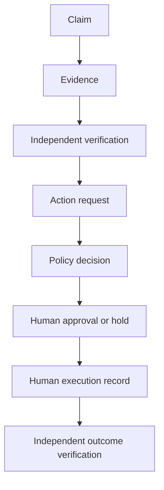

# Control and Evidence Plane Preview

## Enforced boundary

The preview converts proposed actions into durable records. It does not connect
approved actions to an external tool gateway. Execution is performed by an
authorized human and then recorded with an external reference.

Every action is evaluated against:

1. active identity;
2. current agent or operator contract;
3. permitted data classifications;
4. scoped capability grant;
5. portfolio, venture, identity, and action-type kill switches;
6. current evidence belonging to the same venture;
7. available budget and per-grant financial ceiling;
8. rollback or compensation requirements;
9. risk-class-specific human approvals;
10. separation of duties.

Missing controls produce a hold. An explicit denial produces a denial. The
policy engine never converts model confidence into authority.

## Risk behavior

| Class | Preview behavior |
| --- | --- |
| R0 | May be authorized for internal read/draft work after all automatic checks pass. |
| R1 | May be authorized for analysis or sandbox work after all automatic checks pass. |
| R2 | Requires a Venture Sponsor approval and a tested rollback. |
| R3 | Requires verified evidence, rollback, budget, designated-human approval, domain approval, and at least two distinct approvers. |
| R4 | Requires the R3 controls but returns `human_execution_only`; autonomous execution is prohibited. |

## Record sequence

## API sequence

After authentication:

1. `POST /api/v1/governance/claims`
2. `POST /api/v1/governance/evidence`
3. `POST /api/v1/governance/evidence/{id}/verification`
4. `POST /api/v1/governance/actions`
5. `POST /api/v1/governance/actions/{id}/approvals` when requested
6. `POST /api/v1/governance/actions/{id}/executions`
7. `POST /api/v1/governance/actions/{id}/verification`
8. `GET /api/v1/governance/actions/{id}/reconstruction`

Administrative registration of identities, contracts, grants, and budgets
requires `governance:admin` permission. Kill-switch activation and release have
separate permissions and are logged.

## Known limitations

- Audit hashes are chained in the database but not anchored to an independent
  write-once store.
- The preview creates its schema at startup; production migration and rollback
  tooling remains an acceptance item.
- Rate limiting is per process and must move to a gateway for horizontal scale.
- Environment-defined operators are a preview identity source, not enterprise
  federation or phishing-resistant authentication.
- Minimum risk classification uses a bounded deterministic taxonomy. A
  production action registry and broader adversarial synonym coverage remain
  open.
- Immediate policy re-evaluation governs whether a human execution record is
  accepted. It cannot stop a human from acting outside the system.
- There is no agent runtime or external execution adapter.

These limitations are deliberate holds, not hidden capabilities.

The reviewable implementation claims for this release candidate are indexed in
`spec/uat/v1/governed-preview-controls.json`. Each claim identifies its scope,
implementation, automated tests, and the limitation that prevents the claim
from being interpreted as enterprise assurance.
