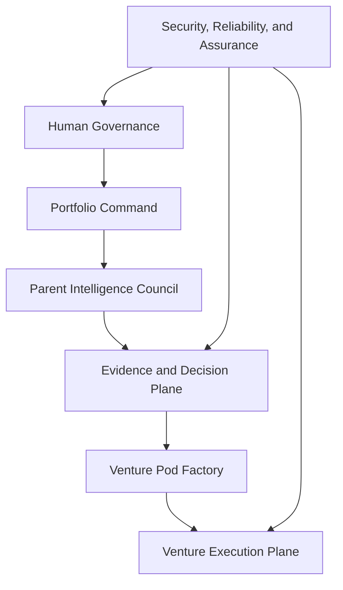

# UAT Enterprise System Specification

## A governed AI-native venture foundry for NetworkMyNetworth

| Field | Value |
| --- | --- |
| Specification | UAT Enterprise Operating System |
| Version | `1.0.0-draft` |
| Date | 2026-07-18 |
| Status | Normative design draft |
| Current runtime status | Simulation skeleton, not production-grade |
| Human owner | System Governor |
| Machine-readable root | `spec/uat/v1/system-manifest.json` |

## 1. Governing decision

Wealth Machine Intelligence will be rebuilt as the Universally Adaptive Team Enterprise Operating System, abbreviated UAT.

UAT is a governed venture institution. It converts uncertain economic signals into evidence-backed, separately controlled ventures through twelve permanent parent agents, independent challenge, deterministic policy controls, isolated Venture Pods, stage-gated capital, and portfolio learning.

UAT is not an autonomous wealth guarantee. It cannot eliminate market loss, human error, legal uncertainty, security compromise, competition, or chance. Its enforceable operating promise is narrower and stronger:

> Every properly authorized operating cycle must create measurable progress, stronger proof, a corrected assumption, or protection from avoidable loss.

If a cycle produces only reports, meetings, agent conversation, code volume, dashboards, or confidence, it has not produced institutional progress.

The system's objective is maximum useful autonomy inside the minimum authority necessary for the current evidence and risk. Human authority remains final over money, contracts, legal entities, regulated activity, employment, sensitive-data exceptions, production launch, constitutional policy, and irreversible consequence.

### 1.1 Naming model

- **NetworkMyNetworth** is the mission and venture-studio ecosystem.
- **Universally Adaptive Team** is the institutional operating model.
- **Wealth Machine Intelligence** is the current software repository implementing that model.
- **Venture Pod** is one isolated company-specific operating organization.

These names MUST NOT be used to imply capabilities the current runtime has not earned.

## 2. Status and truth boundary

This specification defines the target system. It does not describe the current repository as already possessing the target capabilities.

The current repository proves the following limited facts:

- The high-level `NetworkWealthEngine` can run deterministic Income Streams and Team Loop simulations.
- Eight specialized heuristic agents are wired into that simulation.
- Opportunity packets can enter through the DALEOBANKS bridge.
- The bridge forces `requires_human_approval: true` in its returned assessment contract.
- Phase, risk, decision-rule, and SMART-goal scaffolding exists.
- The current local suite passed 29 tests on 2026-07-18.

The current repository does not prove:

- calibrated venture success or failure probabilities;
- real market intelligence or willingness to pay;
- durable evidence, approvals, or lifecycle state;
- secure agent tool execution;
- tenant or Venture Pod isolation;
- production identity and capability enforcement;
- financial execution controls;
- autonomous venture creation or operation;
- commercial repeatability;
- enterprise security, compliance, availability, or recovery.

Specification-integrity tests enforce that this design remains internally complete. They do not prove that runtime controls exist. The manifest therefore keeps `runtime_enforced` set to `false` until the applicable acceptance gates are implemented and independently verified.

## 3. Normative language

The capitalized terms **MUST**, **MUST NOT**, **REQUIRED**, **SHOULD**, **SHOULD NOT**, and **MAY** are normative in the sense used by [RFC 2119](https://www.rfc-editor.org/rfc/rfc2119) and [RFC 8174](https://www.rfc-editor.org/rfc/rfc8174).

The following distinctions are mandatory:

| Term | Meaning |
| --- | --- |
| Claim | A proposition that may be true or false. |
| Evidence | A source-bound observation that changes confidence in a claim. |
| Score | A compressed interpretation. A score is never evidence by itself. |
| Recommendation | Advice with no execution authority. |
| Decision | An authorized selection recorded with evidence, limits, and reversal conditions. |
| Action | A requested or completed change to external or authoritative state. |
| Verified action | An action whose postcondition was confirmed from trusted external state. |
| Autonomy | Authority to perform a defined action without per-action human approval. |
| Production-grade | A measured operating condition earned through the gates in this specification, not a visual or rhetorical label. |

## 4. Constitutional invariants

These rules sit above prompts, models, agents, workflows, and ventures. Ordinary agents cannot alter them.

1. Reality outranks model output.
2. Evidence precedes authority, capital, and scale.
3. Default authorization is deny.
4. No actor may propose, approve, execute, and verify the same consequential action.
5. External content is data, not authority.
6. A model-generated approval, citation, legal status, payment, or execution claim is invalid without the authoritative external record.
7. Human authority controls reserved and irreversible actions.
8. Capital is released in tranches that purchase named evidence.
9. Venture data and authority are isolated by default.
10. Worker agents inherit tasks, not sovereignty.
11. Every consequential action is attributable, policy-checked, bounded, and audited.
12. Every executed action requires postcondition verification.
13. Legal, security, privacy, financial, and incident holds fail closed.
14. Kill switches operate outside the affected model or agent.
15. A venture may be killed without erasing the assets or learning it created.
16. Network participation requires consent, truthful representation, and reciprocal value.
17. No system component may hide its own failure.
18. Unsupported certainty claims are prohibited.

The constitution guarantees process discipline, not external outcomes.

## 5. Objective, non-goals, and success contract

### 5.1 Objective

UAT MUST repeatedly:

1. detect a commercially significant problem;
2. identify the user, beneficiary, buyer, budget owner, risk owner, sponsor, blocker, and veto holder;
3. locate the deeper proof, trust, eligibility, coordination, routing, documentation, or settlement failure;
4. design the cheapest decisive test;
5. collect external evidence;
6. create the smallest lawful commercial wedge;
7. provision an isolated Venture Pod only after the required gates clear;
8. operate through bounded actions, verified outcomes, and explicit economics;
9. allocate additional authority and capital only after proof;
10. preserve reusable knowledge, relationships, infrastructure, and ownership value when a route ends.

### 5.2 Non-goals

UAT MUST NOT optimize for:

- the number of agents;
- the number of ideas;
- unrestricted self-replication;
- founder reassurance;
- document or code volume;
- maximum automation;
- fictional success probabilities;
- speed that outruns evidence or consent;
- extraction that weakens customers, workers, partners, or the surrounding market.

### 5.3 Definition of institutional improvement

The institution is self-improving only when measured performance improves in at least one controlled dimension:

- faster time to decisive evidence;
- lower cost per validated or invalidated assumption;
- better prediction calibration;
- fewer preventable losses;
- higher policy compliance;
- faster recovery;
- more reusable assets;
- lower founder dependency;
- better stakeholder outcomes;
- more capital-efficient movement from signal to recurring cash.

More agents, more memory, or more activity does not establish improvement.

## 6. Current repository disposition

The migration MUST preserve useful contracts while preventing simulation code from receiving production authority.

| Current component | Evidence-based disposition | Required change |
| --- | --- | --- |
| `src/services/venture_protocol.py` | Keep and version | Preserve strict input validation and human-approval invariant. Add schema versioning, provenance references, idempotency, and durable storage. |
| `src/services/opportunity_intake.py` | Keep as compatibility adapter | Remove in-memory assessment authority. Route into the Evidence and Venture Registry services. Treat all inbound strings as untrusted data. |
| `src/network_my_networth/system.py` | Quarantine as simulation facade | Rename or label outputs as simulation. It MUST NOT advance real ventures or authorize external action. |
| `src/agents/specialized.py` | Keep as deterministic test fixtures | Do not represent heuristic formulas as agent intelligence or market proof. Replace gradually with contract-bound parent-agent adapters. |
| `src/services/orchestrator.py` | Replace behind a stable interface | Move from in-process calls to durable, idempotent workflows with human pauses, timeouts, compensation, and event history. |
| `src/core/performance.py` | Replace in-memory authority | Persist goals, bottlenecks, metrics, evidence, and progress events. Do not accept self-reported progress without a verification reference. |
| `src/services/phase_management.py` | Replace with the normative lifecycle | Existing three-phase dictionaries are test scaffolding. Gate transitions MUST be durable, policy-checked, and evidence-linked. |
| `src/services/risk_management.py` | Relabel and constrain | Existing output is an uncalibrated heuristic risk index, not a probability. It may prioritize review but MUST NOT claim probability or independently authorize action. |
| `src/services/ai_agents.py` | Quarantine | Random trend values and formula-derived failure probabilities MUST NOT enter production decisions or customer-facing claims. |
| `src/core/knowledge_graph_connector.py` | Convert to a projection adapter | A graph MAY support discovery. It MUST NOT silently become authoritative when the database fails. Consequential writes fail closed. |
| `src/database/models.py` | Migrate | Replace ambiguous probability fields with typed claims, evidence, decisions, actions, and measured outcomes. Use migrations and preserve legacy records as simulation data. |
| `static/index.html` and `static/app.js` | Node AG0 remediation | Remove `99.99% success rate`, `P(failure) <= 0.01%`, and synthetic risk claims. Lead with active bottleneck, evidence, approvals, exposure, and control status. |
| root `jwt.py` | Remove before any security claim | The file accepts any token and returns a test identity. Test doubles MUST live outside production import paths. |
| `.github/workflows/ci.yml` | Harden | Lint MUST become blocking. Add secret, dependency, schema, policy, adversarial, and supply-chain checks in staged gates. |
| `WealthMachineIntelligenceEnhanced/` | Resolve duplication | Select one source of truth. Archive or remove the duplicate tree after migration evidence shows nothing required is lost. |
| `main.py` and `src/api/main.py` | Consolidate entrypoint | One documented production entrypoint with one authentication and configuration path. |

The migration MUST preserve the existing DALEOBANKS wire contract until a versioned replacement is accepted by both repositories.

## 7. Seven-plane architecture



### 7.1 Human Governance Plane

Humans retain designated authority for:

- constitutional changes;
- venture creation and retirement;
- material capital allocation;
- contracts and legal filings;
- debt and equity;
- regulated activity;
- employment decisions;
- production activation;
- restricted-data exceptions;
- material public claims;
- critical-risk acceptance;
- emergency override and recovery.

Required human roles are System Governor, Investment Committee, Security Authority, Legal Authority, Financial Authority, Privacy or Data Authority, and Venture Sponsor. One person MAY hold several roles during the earliest stage, but the same person MUST NOT satisfy both sides of a required dual-control action.

### 7.2 Portfolio Command Plane

This plane owns portfolio posture, not venture execution. It maintains:

- opportunity backlog;
- venture state and active bottleneck;
- capital and relationship exposure;
- concentration and dependency maps;
- shared infrastructure;
- resource conflicts;
- allocation recommendations;
- retirement and asset-recovery plans.

The Portfolio Governor cannot approve its own allocation recommendation.

### 7.3 Parent Intelligence Council

The permanent council contains the twelve agents defined in `spec/uat/v1/agent-charters.json`:

1. Venture Scout
2. Strategic Market Analyst
3. Product and Business Planning Architect
4. Business Model and Technology Architect
5. Financial Strategist and Capital Allocator
6. Regulatory and Legal Risk Analyst
7. Brand, Distribution and Growth Strategist
8. Network and Coalition Strategist
9. Portfolio Governor
10. Adversarial Assurance and Red-Team Agent
11. Data, Evidence and Knowledge Steward
12. Security, Reliability and Incident Agent

The first eight create commercial capability. The final four prevent the council from becoming a self-validating machine.

The twelve roles define independent duties and records. They do not require twelve simultaneous model processes on day one. Several roles MAY share infrastructure or a model provider while authority remains separated. However, an assurance claim that depends on independent judgment MUST account for correlated model, prompt, retrieval, data, and provider failure. High-consequence challenge SHOULD use genuinely independent evidence retrieval and, where justified, a different model or human reviewer.

### 7.4 Evidence and Decision Plane

This is the authoritative institutional truth layer. It owns:

- claims and evidence;
- assumptions and contradictions;
- experiments and results;
- venture gates and transitions;
- agent contracts and capabilities;
- action requests and policy decisions;
- approvals;
- budgets and resource reservations;
- audit and incident records;
- verified outcomes and lessons.

No vector store, chat history, graph, dashboard, or model context is authoritative.

### 7.5 Venture Pod Factory

The factory classifies the venture, calculates risk, generates a charter, provisions a scoped environment, runs preactivation tests, and requests staged authority. Only the factory, under policy and human approval, may create a Venture Pod.

### 7.6 Venture Execution Plane

Venture Pods operate here. Each pod has its own identities, contracts, data namespace, secrets, tools, budget, events, metrics, support obligations, and shutdown path. A typical pod includes:

- Venture General Manager;
- Product Operations;
- Engineering or Automation;
- Sales;
- Marketing;
- Customer Success;
- Finance Controller;
- Security and Reliability.

The exact roster follows the business model and risk, not a generic template.

### 7.7 Security, Reliability, and Assurance Plane

This plane crosses every other plane without becoming a universal administrator. It provides policy enforcement, threat detection, evaluation, logging, incident control, recovery, independent challenge, and control evidence.

## 8. Deployment strategy and service boundaries

### 8.1 Architectural decision

The first production-capable version SHOULD be a hardened modular monolith with a relational system of record, transactional outbox, isolated worker runtime, policy-enforcing tool gateway, object evidence store, and durable workflow engine.

Premature microservices would increase authentication paths, network failure modes, deployment burden, cost, and reconciliation risk before UAT has proven one Venture Pod. Services SHOULD split only when one of these conditions is measured:

- a distinct security or regulatory boundary;
- independent scaling pressure;
- independent availability objective;
- deployment cadence conflict;
- data residency requirement;
- team ownership boundary;
- unacceptable blast radius.

### 8.2 Logical services

These are mandatory logical boundaries even when deployed together.

| Service | Owns | MUST NOT own |
| --- | --- | --- |
| Identity and Capability Service | human, agent, service identities; contracts; scoped grants; expiry; revocation | business evidence or venture decisions |
| Policy Decision Service | deny-by-default evaluation of identity, action, target, evidence, risk, budget, holds, and approvals | credentials or tool execution |
| Approval Service | signed human and independent-agent approvals; delegation; expiry; dual control | propose or execute the action |
| Evidence Ledger | claims, evidence, provenance, contradictions, integrity, review dates | gate transition authority |
| Venture Registry | lifecycle state, posture, bottleneck, gate requirements, transition records | evaluate its own transition proof |
| Workflow Orchestrator | durable workflow state, retries, pauses, compensation, deadlines | constitutional policy or secrets |
| Agent Registry and Factory | agent contracts, templates, hierarchy, versions, quotas, lifecycle | self-approval or unrestricted spawning |
| Tool Gateway | schema validation, target controls, egress, idempotency, side-effect execution, postcondition retrieval | decide its own authorization |
| Budget and Capital Service | reservations, caps, vendor limits, ledger, variance, freeze | master credentials in model context |
| Portfolio Service | exposure, concentration, option tranches, allocation recommendations | independent approval or payment execution |
| Knowledge Projection Service | authorized graph, search, vector, and analytics projections | authoritative claims or permissions |
| Audit and Event Service | append-only event envelope, integrity metadata, replication, export | silent mutation or deletion by agents |
| Model Assurance Service | model, prompt, retrieval, policy versions; evaluations; canary; rollback | gate approval by model confidence alone |
| Incident Control Service | holds, quarantine, kill switches, recovery state, evidence preservation | depend on affected agent cooperation |
| Operator API and Command Center | human visibility, approval, intervention, explanation, export | bypass service policy through the UI |

Every service call MUST carry authenticated workload identity, venture scope, correlation ID, causation ID, and request version.

## 9. Authoritative data architecture

### 9.1 Store responsibilities

| Store | Responsibility | Authority |
| --- | --- | --- |
| PostgreSQL | transactional venture, evidence metadata, policy, approval, action, budget, agent, incident, and workflow state | authoritative |
| Object storage with retention controls | source documents, recordings, exports, artifacts, signed evidence payloads | authoritative payload store |
| Event log and transactional outbox | ordered state-change delivery, replay, integration, audit export | authoritative event source after commit |
| Graph database or graph projection | relationships, dependencies, introduction paths, capability and control graphs | derived projection |
| Search index | authorized lexical retrieval | derived projection |
| Vector index | semantically useful retrieval with venture and classification filters | derived projection only |
| Analytics warehouse | longitudinal metrics, calibration, portfolio comparison | derived from authoritative events |
| Agent working memory | current bounded task context | ephemeral and non-authoritative |

Consequential writes MUST fail closed when the authoritative store is unavailable. The system MUST NOT silently fall back to an in-memory graph and report success.

### 9.2 Core relational model

The first migration SHOULD create these bounded aggregates:

| Aggregate | Required records |
| --- | --- |
| Opportunity | `opportunities`, `opportunity_sources`, `opportunity_actors` |
| Epistemic | `claims`, `evidence_records`, `claim_evidence_links`, `contradictions`, `assumptions`, `assumption_tests` |
| Experiment | `experiments`, `experiment_variants`, `measurements`, `outcome_verifications` |
| Venture | `ventures`, `venture_charters`, `venture_transitions`, `venture_holds`, `active_bottlenecks` |
| Governance | `decisions`, `decision_options`, `policy_decisions`, `approvals`, `delegations`, `conflicts_of_interest` |
| Agents | `agents`, `agent_contracts`, `capability_grants`, `agent_versions`, `worker_leases` |
| Actions | `action_requests`, `action_attempts`, `tool_executions`, `postcondition_checks`, `compensations` |
| Capital | `budgets`, `budget_reservations`, `spend_requests`, `financial_ledger_entries`, `vendor_limits` |
| Network | `relationship_entities`, `consents`, `introduction_paths`, `contributions`, `reciprocity_obligations` |
| Assurance | `evaluations`, `evaluation_runs`, `findings`, `risk_acceptances`, `incidents`, `recovery_exercises` |
| Models | `model_versions`, `prompt_versions`, `retrieval_versions`, `policy_bundle_versions`, `benchmark_results` |
| Learning | `lessons`, `lesson_evidence_links`, `reusable_assets`, `asset_transfers` |
| Eventing | `event_outbox`, `audit_events`, `integration_checkpoints`, `dead_letter_items` |

Every mutable aggregate MUST use optimistic concurrency or an equivalent version check. Every external mutation MUST use an idempotency key.

### 9.3 Claim types and evidence grades

Claims MUST be typed as:

- verified fact;
- supported inference;
- strategic hypothesis;
- assumption;
- unknown;
- contradiction.

Evidence grades are:

| Grade | Meaning | May independently advance a gate? |
| --- | --- | --- |
| E0 assertion | Unverified statement, model output, or unattributed claim | No |
| E1 source-supported | Traceable source supports the claim within stated scope | Only Gate 0 or Gate 1 |
| E2 direct observation | Workflow, operational record, authenticated dataset, or reproducible test | Conditional |
| E3 counterparty commitment | Verified costly or binding action by an authorized external actor | Yes, where the gate calls for commitment |
| E4 paid outcome | Payment and delivered result are both verified | Yes |
| E5 repeatable outcome | Comparable external outcomes repeat across customers, cohorts, operators, or time | Required for repeatability and scale |

An evidence grade does not establish relevance outside its scope. Every record MUST include source, timestamp, owner, venture, classification, scope, verification status, integrity reference, contradictions, limitations, review date, and expiry when applicable.

The normative schema is `spec/uat/v1/schemas/evidence-record.schema.json`.

## 10. Venture lifecycle and gates

The normative state machine is `spec/uat/v1/venture-lifecycle.json`.

```mermaid
stateDiagram-v2
    [*] --> Signal
    Signal --> Opportunity
    Opportunity --> ProblemValidated
    ProblemValidated --> BuyerValidated
    BuyerValidated --> SolutionValidated
    SolutionValidated --> EconomicsValidated
    EconomicsValidated --> ReadinessValidated
    ReadinessValidated --> ControlledPilot
    ControlledPilot --> PaidLaunch
    PaidLaunch --> Repeatable
    Repeatable --> Scale
    Scale --> Mature
    Mature --> Integrated
    Mature --> Harvest
    Mature --> Retired
```

### 10.1 Transition protocol

Every forward transition MUST execute this sequence:

1. freeze the requested evidence set;
2. verify provenance, freshness, scope, consent, and integrity;
3. record the strongest contradiction and unresolved assumption;
4. run the required red-team and domain checks;
5. evaluate legal, security, privacy, budget, conflict, and posture holds;
6. obtain independent verification;
7. request required human approvals;
8. commit the transition and decision atomically;
9. publish the transition event through the transactional outbox;
10. recalculate the active bottleneck, metric, budget, and authority ceiling.

No gate may be skipped. Prior evidence MAY be reused only when scope, freshness, consent, and applicability are reverified.

### 10.2 Holds, pause, quarantine, and retirement

- A **hold** preserves state but blocks new authority or capital.
- A **pause** stops planned work while preserving recoverable state and obligations.
- **Quarantine** revokes affected capabilities and transfers control to Incident Command.
- **Retirement** reconciles customers, vendors, data, credentials, obligations, assets, and lessons before final closure.

Kill does not mean erase. Evidence and lawful retention requirements survive venture termination.

### 10.3 Active Single Bottleneck Metric

Each active venture MUST have one primary bottleneck and one primary metric with a plausible causal relationship to clearing it. Parallel tasks are allowed only when they strengthen that gate.

Examples:

| Active gate | Valid bottleneck metric | Vanity substitute to reject |
| --- | --- | --- |
| Problem validation | independently verified recurring problem records | reports generated |
| Buyer validation | qualified buyers taking a costly or binding action | contacts scraped |
| Solution validation | verified minimum value events | features completed |
| Economics validation | paid evidence and contribution margin range | forecast revenue |
| Repeatability | comparable outcomes delivered by another operator or pod | founder effort |
| Scale | incremental contribution and service performance under higher load | total users without economics |

## 11. Agent system

### 11.1 Three agent classes

| Class | Scope | Persistence | Authority ceiling |
| --- | --- | --- | --- |
| Parent agent | Portfolio-wide domain intelligence or control | Permanent, versioned | Analysis, challenge, recommendation, specialized holds as declared |
| Venture agent | One Venture Pod | Venture lifecycle | Bounded by charter, venture, environment, budget, and action class |
| Worker agent | One narrow task | Temporary lease | Minimum task capabilities; no inherited sovereignty |

### 11.2 Agent contract

No agent may become active without a valid contract conforming to `spec/uat/v1/schemas/agent-contract.schema.json`.

The contract MUST define:

- identity, class, version, owner, parent, and venture;
- mission and exact outputs;
- allowed inputs and tools;
- capabilities and environment;
- prohibited actions;
- data classification, field, venture, and egress scope;
- money, token, compute, tool, worker, and depth budgets;
- approval and escalation rules;
- evidence requirements;
- performance and calibration metrics;
- logging requirements;
- retry, pause, quarantine, and termination policy;
- start, expiry, status, and signature reference.

Capabilities MUST be time-limited and independently revocable. Agent self-description never grants authority.

### 11.3 Worker creation

A parent or venture agent MAY request a worker only when:

1. the task and completion test are bounded;
2. existing agents cannot perform it efficiently;
3. inputs, outputs, data, tools, and cost are known;
4. the worker receives no undeclared authority;
5. depth, count, duration, and budget remain inside policy;
6. a parent and human owner remain accountable;
7. the factory approves the lease.

Workers MUST expire, release capabilities, and preserve their outcome record. Idle workers MUST terminate automatically.

### 11.4 Agent performance

Agents are measured on:

- evidence accuracy and provenance;
- prediction calibration;
- contradiction detection;
- invalid assumptions caught;
- downstream acceptance;
- policy compliance;
- correct escalation;
- repeated error rate;
- human correction rate;
- cost per accepted outcome;
- measured effect on time or cost to proof.

Agreement, confidence, verbosity, and output count are not performance metrics.

## 12. Venture Pod Factory

The factory executes this controlled sequence:

1. accept an approved venture specification;
2. classify the venture and regulated activities;
3. calculate risk and data classifications;
4. generate a signed venture charter;
5. select a minimum agent roster;
6. create venture-scoped identities and namespaces;
7. assign scoped tools, model routes, budgets, secrets, and rate limits;
8. load only approved knowledge;
9. run normal, failure, malicious-input, disagreement, budget, and recovery simulations;
10. request human activation;
11. operate in shadow mode;
12. run a restricted canary;
13. grant bounded production authority only after gate evidence;
14. monitor, correct, suspend, expand, or retire.

Each pod MUST have:

- charter;
- sponsor;
- business thesis and falsification conditions;
- customer and data scope;
- agent contracts;
- approved models and tools;
- budget and transaction ceilings;
- action-risk matrix;
- success, guardrail, and kill metrics;
- SLOs and runbooks;
- support and escalation;
- incident and recovery plan;
- asset-preservation and retirement plan.

## 13. Action authorization and execution

The normative approval matrix is `spec/uat/v1/approval-matrix.json`. The action request schema is `spec/uat/v1/schemas/action-request.schema.json`.

### 13.1 Risk classes

| Class | Description | Default approval |
| --- | --- | --- |
| R0 | Internal read or draft with no external side effect | Policy decision |
| R1 | Isolated, reversible sandbox execution | Preauthorized policy or human |
| R2 | Bounded, reversible external action | Policy plus preapproval or sampled review |
| R3 | High financial, legal, privacy, security, customer, employment, or reputational consequence | Explicit designated human |
| R4 | Irreversible or reserved human action | Designated human plus applicable domain authority; autonomous execution prohibited |

### 13.2 Policy evaluation order

Every requested side effect MUST pass, in order:

1. authenticated identity;
2. active agent contract;
3. venture and environment scope;
4. unexpired capability grant;
5. data classification and egress rules;
6. action-risk classification;
7. current venture posture and gate evidence;
8. budget reservation and vendor limit;
9. legal, security, privacy, incident, and conflict holds;
10. required independent and human approvals;
11. idempotency and precondition check;
12. tool gateway schema and target check.

The tool gateway then executes once, retrieves authoritative external state, verifies postconditions, reconciles resource use, writes the audit outcome, and triggers compensation or incident handling when the result differs from the approved request.

### 13.3 Financial execution

No model or agent receives a master payment credential. The Financial Execution Service requires:

- approved purpose;
- action and venture IDs;
- verified vendor or counterparty;
- budget reservation;
- action-risk classification;
- fraud and conflict checks;
- required dual authorization;
- idempotency key;
- verified transaction result;
- immutable ledger reference.

Daily, monthly, vendor, category, agent, venture, and portfolio caps MUST be enforced atomically. Spending freeze MUST operate independently of the agent runtime.

### 13.4 External-state verification

An agent's statement that an email was sent, payment completed, deployment succeeded, contract signed, record changed, or customer outcome occurred is never sufficient. The system MUST query or receive trusted external state and record a postcondition check.

## 14. API contract

### 14.1 API rules

All production APIs MUST:

- use explicit versions;
- authenticate human or workload identity;
- derive venture and tenant scope from trusted identity and policy, not only request parameters;
- validate strict schemas and reject unknown fields on consequential requests;
- accept an idempotency key for mutations;
- support optimistic concurrency for state changes;
- return correlation and decision references;
- avoid returning secrets or cross-venture fields;
- distinguish recommendation, approval, execution, and verification status;
- record audit events before acknowledging a consequential result;
- rate-limit by identity, venture, route, action class, and cost;
- use stable machine codes rather than parsing human prose.

The current DALEOBANKS endpoints remain compatibility aliases until both repositories accept a versioned migration.

### 14.2 Required endpoints

| Method and path | Purpose | Minimum authority |
| --- | --- | --- |
| `POST /api/v1/opportunities` | Submit a source-bound OpportunityPacket | authorized intake identity |
| `GET /api/v1/opportunities/{id}` | Read opportunity, claim, and gate summary | scoped read capability |
| `POST /api/v1/claims` | Register a typed claim | evidence-write capability |
| `POST /api/v1/evidence` | Register evidence metadata and payload reference | evidence-write capability |
| `POST /api/v1/assumptions/{id}/tests` | Register a falsification test | experiment-design capability |
| `POST /api/v1/experiments` | Create a bounded experiment | policy allow and budget reservation |
| `POST /api/v1/experiments/{id}/measurements` | Record measured outcomes | measurement capability |
| `POST /api/v1/ventures/{id}/transition-requests` | Request a lifecycle transition | Portfolio Governor recommendation capability |
| `GET /api/v1/ventures/{id}/transition-evidence` | Reconstruct gate proof and contradictions | scoped audit read |
| `POST /api/v1/venture-pods` | Request pod creation after gate clearance | System Governor and Investment Committee |
| `POST /api/v1/agent-contracts` | Propose an agent contract | factory capability |
| `POST /api/v1/agent-contracts/{id}/activate` | Activate a signed contract | policy plus designated approval |
| `POST /api/v1/actions` | Request a consequential action | active contract and capability |
| `GET /api/v1/actions/{id}` | Read request, policy, approval, execution, and verification state | scoped read |
| `POST /api/v1/actions/{id}/approvals` | Record approval or denial | designated approver identity |
| `POST /internal/v1/policy/evaluate` | Evaluate an action context | trusted control-plane workload only |
| `POST /api/v1/incidents` | Declare or escalate an incident | any authenticated actor; anonymous channel MAY be added separately |
| `POST /api/v1/kill-switches/{scope}` | Freeze agent, tool, spend, publication, venture, or portfolio | designated incident authority |
| `POST /api/v1/recovery/{scope}/activate` | Activate approved recovery or manual mode | incident authority plus runbook |
| `GET /api/v1/portfolio/exposure` | Read capital, relationship, dependency, data, and operational exposure | portfolio read capability |
| `POST /api/v1/portfolio/allocation-recommendations` | Create a tranche recommendation | Portfolio Governor and Financial Strategist |
| `GET /api/v1/audit/decisions/{id}` | Reconstruct a decision | scoped audit authority |
| `POST /api/v1/audit/exports` | Generate a controlled audit export | audit authority and policy approval |

### 14.3 Action response states

`POST /api/v1/actions` MUST never imply execution merely because the request was accepted. It returns one state:

- `denied`;
- `needs_evidence`;
- `needs_approval`;
- `authorized_pending_execution`;
- `executing`;
- `executed_pending_verification`;
- `verified`;
- `compensating`;
- `failed`;
- `quarantined`.

Only `verified` establishes completed external state.

### 14.4 Error semantics

Policy denials MUST return a stable denial code and a safe explanation. They MUST NOT expose hidden policy internals, secrets, or another venture's existence. Retrying a permanent denial without changed evidence, authority, or policy MUST be blocked or rate-limited.

## 15. Events and durable workflows

### 15.1 Event envelope

Every material state change produces an event with:

- `event_id`;
- `event_type` and schema version;
- `occurred_at` and `recorded_at`;
- authenticated actor and contract;
- venture and portfolio scope;
- correlation and causation IDs;
- aggregate ID and version;
- data classification;
- payload reference or bounded payload;
- policy and approval references when applicable;
- integrity metadata.

Events MUST be committed through a transactional outbox with the authoritative state change. Consumers MUST be idempotent. Ordering guarantees MUST be defined per aggregate, not assumed globally.

### 15.2 Required event families

- `opportunity.submitted`, `opportunity.classified`, `opportunity.killed`;
- `claim.registered`, `evidence.verified`, `evidence.disputed`, `assumption.invalidated`;
- `experiment.authorized`, `experiment.started`, `measurement.recorded`, `experiment.closed`;
- `venture.transition_requested`, `venture.held`, `venture.transitioned`, `venture.paused`, `venture.retired`;
- `pod.requested`, `pod.provisioned`, `pod.activated`, `pod.quarantined`;
- `agent.contract_proposed`, `agent.activated`, `agent.paused`, `agent.revoked`, `worker.expired`;
- `action.requested`, `action.denied`, `action.approved`, `action.executed`, `action.verified`, `action.compensated`;
- `budget.reserved`, `budget.threshold_crossed`, `spend.executed`, `spend.frozen`;
- `security.signal`, `incident.declared`, `kill_switch.activated`, `recovery.completed`;
- `model.evaluated`, `model.promoted`, `model.rolled_back`;
- `lesson.approved`, `asset.registered`, `asset.transferred`.

### 15.3 Workflow requirements

Durable workflows MUST support:

- persisted checkpoints;
- versioned definitions;
- explicit timeouts;
- bounded retries with backoff;
- dead-letter handling;
- idempotent activities;
- human approval pauses;
- compensation for partially completed actions;
- cancellation and quarantine;
- replay without duplicating side effects;
- manual takeover;
- final reconciliation.

## 16. Security architecture

### 16.1 Trust boundaries

The system assumes that humans, agents, models, prompts, memories, documents, websites, APIs, dependencies, vendors, and networks may be wrong or compromised.

The following boundaries MUST be explicit:

- human to control plane;
- parent agent to portfolio data;
- Venture Pod to control plane;
- one venture to another;
- model context to tool gateway;
- untrusted content to evidence intake;
- tool gateway to external system;
- build system to artifact registry;
- operator interface to privileged control;
- primary environment to backup and recovery environment.

### 16.2 Identity and access

- Every human, agent, workload, and tool integration MUST have a unique identity.
- Human privileged access MUST use phishing-resistant MFA when technically feasible.
- Workload credentials MUST be short-lived and scoped.
- Production access MUST be just-in-time, time-limited, and audited.
- Shared consequential accounts and master credentials are prohibited.
- Authorization MUST evaluate role, attributes, venture, environment, action, data, budget, time, posture, and evidence.
- Revocation MUST not depend on the target agent.

### 16.3 Secret isolation

Secrets MUST remain in a dedicated secret service. Models receive neither raw long-lived credentials nor secret inventories. The tool gateway MAY obtain a short-lived credential after policy allow and MUST bind it to the approved target and action where the provider supports that restriction.

Prompts, logs, traces, evidence summaries, source code, tests, and agent memory MUST be scanned or designed to prevent secret persistence.

### 16.4 Untrusted content

Retrieved or uploaded content MUST be tagged as untrusted and isolated from constitutional instructions. It cannot modify:

- identity;
- agent contract;
- capability;
- approval;
- budget;
- venture scope;
- system prompt;
- policy bundle;
- evidence verification status.

High-risk actions MUST be reconstructed from trusted state after untrusted content is processed.

### 16.5 Venture isolation

Each Venture Pod MUST use venture-scoped authorization, namespaces, secrets, retrieval filters, storage paths, encryption context, queues, caches, events, budgets, and audit views.

Cross-venture learning requires a deliberate abstraction record approved by the Data, Evidence and Knowledge Steward. It transfers a general lesson, not the other venture's customer list, contract, strategy, prompt context, or private data.

### 16.6 Audit integrity

Audit events MUST be append-only to application actors, integrity-checked, time-synchronized, and replicated to a boundary ordinary agents cannot alter. "Immutable" is not an absolute claim. The control objective is detectable unauthorized change plus a reconstructable independent copy.

### 16.7 Kill switches

Out-of-band controls MUST exist for:

- one agent;
- one department;
- one tool or model;
- spending;
- external publication;
- one Venture Pod;
- all Venture Pods;
- portfolio observation-only mode.

Exercises MUST prove credential revocation, job cancellation, network isolation, transaction freeze, evidence preservation, and recovery without model cooperation.

### 16.8 Threat model

The normative threat-to-control-to-evaluation map is `spec/uat/v1/threat-model.json`. Every accepted risk requires an owner, rationale, compensating controls, review date, and expiry. A finding cannot be closed solely by the team that authored the remediation.

## 17. Secure software supply chain

The repository MUST progressively enforce:

1. protected default branch and required review;
2. blocking lint and tests;
3. secret scanning;
4. dependency and license review;
5. static application and infrastructure analysis;
6. schema and policy tests;
7. agent adversarial evaluations;
8. isolation and authorization tests;
9. software bill of materials;
10. pinned dependencies and reviewed updates;
11. signed artifacts and build provenance;
12. deployment authorization;
13. canary and rollback;
14. vulnerability intake, severity, remediation, and disclosure process.

Development, test, staging, and production MUST remain separated. Production data may enter a lower environment only through an approved minimization and sanitization process.

## 18. Reliability and resilience

### 18.1 Reliability doctrine

Probabilistic models may propose. Deterministic controls govern identity, schemas, state, budget, policy, execution, and audit.

Every production workflow MUST define:

- owner;
- dependency map;
- service-level indicators;
- service-level objectives;
- error budget;
- timeout and retry policy;
- idempotency boundary;
- compensation;
- degraded mode;
- manual fallback;
- recovery time objective;
- recovery point objective;
- alert and escalation;
- retirement procedure.

Numerical objectives MUST come from business impact and customer obligations. This draft does not invent universal uptime, RTO, or RPO numbers before the first Venture Pod's criticality is known.

### 18.2 Non-negotiable control objectives

- A policy-service failure denies consequential actions.
- An acknowledged authoritative state change is durable to the approved RPO.
- A duplicate request does not create a duplicate intended side effect.
- A partially failed action is reconciled or compensated.
- A queue backlog cannot silently age past its business deadline.
- A backup is not counted until a restoration exercise succeeds.
- A recovery plan is not counted until manual takeover or degraded mode is exercised.
- A model-provider outage cannot disable kill switches, approvals, audit access, or financial freezes.

### 18.3 Failure exercises

Before production authority expands, tests MUST cover:

- database corruption;
- event loss, duplication, delay, and reordering;
- model and tool outage;
- credential revocation;
- vendor cost increase or account freeze;
- object-store and backup loss;
- administrator compromise;
- key-person unavailability;
- customer concentration loss;
- payment processor failure;
- conflicting agent outputs;
- budget exhaustion;
- operator approval overload.

## 19. AI and model governance

### 19.1 Assurance record

Every model-routed agent version MUST have:

- intended purpose and prohibited uses;
- model and provider version;
- prompt, policy, retrieval, and tool bundle versions;
- allowed data classifications and regions;
- evaluation suite and results;
- known limitations and failure modes;
- calibration record where numeric predictions are used;
- cost and latency profile;
- escalation and fallback;
- owner and review date;
- canary and rollback state.

### 19.2 No invented probabilities

A heuristic score MUST be labeled `heuristic_score`, not `probability`, `likelihood`, `success rate`, or `failure rate`.

A predicted probability MAY be used only when:

1. the target event and horizon are defined;
2. training and evaluation populations are relevant;
3. sample size and base rate are recorded;
4. out-of-sample calibration is measured;
5. uncertainty intervals and limitations are visible;
6. drift is monitored;
7. the prediction is not the sole gate authority.

The current repository's formula-derived `failure_probability` does not meet these conditions.

### 19.3 Change control

Every material model, prompt, retrieval, tool, or policy change MUST run the versioned evaluation suite against the exact proposed bundle. Promotion requires no unapproved regression in evidence accuracy, policy compliance, escalation, safety, cost, or latency. Rollback MUST be tested before promotion.

## 20. Network, contribution, and regenerative economics

### 20.1 Trust-routing graph

The Network and Coalition Strategist maintains consent-aware records for:

- expertise;
- observed problems;
- decision authority;
- access and introduction paths;
- relationship strength and source;
- consent and communication limits;
- reciprocal value;
- contributions and obligations;
- conflicts;
- concentration and reputational risk.

The system MUST never infer that a relationship grants endorsement, access, labor, data, or permission.

Every recommended outreach MUST state:

1. the assumption the person can help test;
2. why the relationship path is legitimate;
3. the smallest ethical request;
4. the value the person receives;
5. what consent exists;
6. what the system must not imply.

### 20.2 Contribution ledger

The system SHOULD record authorized contributions of capital, labor, intellectual property, introductions, customer access, guarantees, expertise, operating responsibility, and ongoing maintenance.

Compensation and ownership require written human agreements. Possible mechanisms include salary, contract payment, bonus, revenue share, profit participation, phantom equity, actual equity, cooperative interest, venture carry, and portfolio participation.

AI agents cannot own equity. The system may recommend allocations but cannot promise or execute them.

### 20.3 Regenerative quality gate

Every venture MUST answer:

- Who becomes more capable because this exists?
- What waste, fraud, delay, exclusion, or exploitation becomes harder?
- What capacity transfers to customers, workers, or partners?
- Does revenue depend on keeping participants confused, addicted, trapped, or powerless?
- Does growth improve or degrade the surrounding system?

A venture that depends on preserving preventable harm fails the quality gate even if projected profit is attractive.

## 21. Portfolio and capital allocation

### 21.1 Hard gates before scoring

A venture is ineligible for new capital when it:

- violates law, safety, consent, or constitutional policy;
- lacks a specific reachable actor with pain and authority;
- depends on inaccessible data, distribution, capital, or permission without a testable bridge;
- has no bounded test before major commitment;
- has unresolved critical legal, security, privacy, or financial holds;
- cannot state what evidence the next tranche buys.

### 21.2 Tranche contract

Every capital request MUST specify:

- amount and currency;
- exact use;
- duration;
- active bottleneck;
- evidence expected;
- milestone and guardrails;
- downside and maximum loss;
- reusable asset preserved;
- stop, pause, and kill conditions;
- decision date after the test.

Prior spending is never a reason to release the next tranche.

### 21.3 Comparative allocation dimensions

Surviving ventures are compared on:

- probability of obtaining decisive evidence;
- time and capital required to evidence;
- reversibility and survival impact;
- qualified buyer commitment;
- revenue quality and cash timing;
- unit economics and operating burden;
- defensible control-layer ascent;
- distribution plausibility;
- concentration and dependency;
- reusable infrastructure and knowledge;
- stakeholder value and regenerative fit.

A weighted score MAY support comparison, but it cannot override hard gates and MUST expose evidence confidence and the weakest assumption.

### 21.4 Control efficiency

Governance that blocks every trivial action would destroy the learning speed UAT is meant to create. The control plane MUST therefore measure its own cost and failure:

- approval latency by risk class;
- policy false-denial and false-allow findings;
- percentage of R0 and R1 work handled without human interruption;
- override and approval-fatigue rates;
- cost per controlled action;
- time lost to unavailable evidence or ambiguous ownership;
- incidents prevented, detected, contained, and recovered;
- controls retired because they add burden without reducing a named risk.

The goal is not more approval. It is the least control that fully contains the action's credible downside.

## 22. Operator command center

The primary interface MUST lead with decisions and exposure, not fictional certainty.

It must answer immediately:

1. What is happening?
2. Why is it happening?
3. What evidence supports that explanation?
4. What is the system authorized to do next?
5. What requires human intervention?

Required views are:

- active single bottleneck and metric;
- evidence proven, disputed, expired, and missing;
- approval inbox with risk and deadline;
- venture state, posture, gate, and next proof;
- money, compute, relationship, data, regulatory, and dependency exposure;
- agent contract, version, override, correction, cost, and policy status;
- open holds, incidents, vulnerabilities, and kill-switch state;
- backup, recovery, and SLO status;
- network paths with consent, smallest ask, and reciprocal value;
- material decision reconstruction.

The controlling prompt is:

> What is the smallest authorized action that will produce the most decision-changing evidence today?

## 23. Testing and evaluation

The normative evaluation catalog is `spec/uat/v1/evaluation-suite.json`. Testing MUST include:

- unit tests for schemas, policies, transitions, and calculations;
- integration tests across identity, policy, approvals, budget, tools, workflow, and audit;
- end-to-end tests from signal through verified outcome and retirement;
- policy tests that attempt prohibited actions;
- prompt, memory, retrieval, tool, privilege, and exfiltration attacks;
- business attacks using fake buyers, fabricated evidence, circular validation, metric gaming, and sunk-cost escalation;
- economic simulations for lower conversion, higher CAC, churn, delayed revenue, cost increases, and concentration;
- chaos and recovery exercises;
- cross-venture isolation tests;
- human-factors tests for approval fatigue, alert comprehension, override, and incident command;
- continuous versioned evaluation for every model, prompt, policy, retrieval, and tool change.

Every confirmed failure MUST produce a regression test, control change, or explicitly accepted risk with expiry.

## 24. Backcasted implementation architecture

### 24.1 GPS lock

- **Destination:** UAT can take one real opportunity from source-bound signal through paid, repeatable Venture Pod operation, then use verified reusable assets to make a second venture reach proof faster or cheaper, while all consequential actions remain attributable, bounded, reversible where possible, and human-controlled where reserved.
- **Current position:** 29 simulation tests pass; the repository contains useful orchestration and bridge scaffolding but lacks the authoritative Evidence Plane and external control plane. Unsupported probability claims and an unsafe root JWT test stub remain.
- **Active node:** AG0, epistemic credibility.
- **Active gate:** current interfaces and models blur simulation scores, probabilities, evidence, and capability claims.
- **Gate-crossing evidence:** every consequential repository claim is either source-traceable, measured, or explicitly labeled simulation, heuristic, hypothesis, or target.
- **Active Single Bottleneck Metric:** credible claim coverage, defined as consequential claims with valid evidence or an explicit non-factual label divided by all consequential claims inventoried.
- **Baseline:** unknown until the automated and human claim inventory is complete; known violations already exist.
- **Target:** 100 percent before external autonomy expands.
- **Resource ceiling:** time-box AG0 to ten working days, zero new external autonomy, and no new financial execution. Recalculate scope if the inventory reveals a deeper migration dependency.
- **Three-step system:** select one unsupported claim class, replace or relabel it with evidence, then record the test and update coverage.
- **Review cadence:** daily during AG0; gate review when coverage reaches 100 percent and the required evaluations pass.

### 24.2 Route tournament

The architecture considered four materially different routes.

The score below is comparative architectural fit, not a probability of commercial success.

| Route | Fit / 100 | Evidence confidence | Strength | Fatal weakness | Disposition |
| --- | ---: | --- | --- | --- | --- |
| Agent-first autonomy | 24 | High | Visible speed and demos | Fails control, evidence, security, and human-authority hard gates | Reject |
| Security-first microservice rebuild | 57 | Medium | Strong theoretical isolation | High cost and failure surface before one commercial workflow is proven | Defer |
| Credibility-only cleanup | 63 | High | Fast and necessary | Does not create runtime governance or paid proof | Use only as AG0 |
| Evidence-led control-plane vertical slice | 88 | Medium | Builds truth, authority, one full workflow, and reusable controls in sequence | Requires disciplined scope and one real pilot | Select |

The winning path is:

`credibility -> evidence ledger + control plane -> one Venture Pod -> controlled recursion -> portfolio allocation -> independent assurance`

### 24.3 Strongest counterargument

The strongest case against this architecture is that UAT could become a governance bureaucracy that spends more time classifying, approving, and auditing work than learning from customers.

That failure is plausible. The answer is not to remove controls. It is to make control proportional to consequence: R0 and R1 work should flow automatically; R2 work should use bounded preauthorization and sampling; only R3 and R4 work should carry mandatory human control. Control latency, false denials, operator load, and evidence value are measured. A control that cannot name the loss it prevents or detect is redesigned or retired.

### 24.4 Critical assumption register

| Assumption | Confidence | Why it matters | Cheapest decisive test | Consequence if false |
| --- | --- | --- | --- | --- |
| One reachable venture has a buyer willing to provide binding or paid evidence | Medium | AG4 cannot clear without real external behavior | Secure one paid diagnostic, deposit, or bounded pilot with a verified buyer | Return to buyer discovery; do not build a pod |
| A modular monolith can enforce the first pod's boundaries | Medium | Avoids premature distributed-system cost | Threat model and isolation test the first vertical slice | Split the security-critical boundary before pilot |
| Human authorities can respond inside business deadlines without rubber stamping | Low until measured | Approval delay can destroy speed or create bypass pressure | Run shadow approval queues and measure latency, overrides, and comprehension | Narrow R3/R4 scope, add qualified delegates, or pause external autonomy |
| The DALEOBANKS bridge can remain compatible during schema migration | Medium | Breaking intake would erase a working integration asset | Contract tests against both repositories' fixtures and version negotiation | Maintain a compatibility adapter or coordinate a joint release |
| Venture-private data can be abstracted into reusable lessons without leakage | Medium | Portfolio compounding depends on safe transfer | Red-team a sample lesson through tenant, privacy, and inference tests | Restrict learning to aggregated or human-approved artifacts |
| Existing heuristic code can be quarantined without breaking useful tests | High | AG0 requires ending false authority while preserving learning assets | Relabel simulation outputs and run the full suite | Fork a legacy simulation package and remove it from production imports |
| The first pod's legal and data scope can be bounded to one tractable jurisdiction and use case | Unknown | Broad scope could stall AG4 or create unacceptable risk | Counsel-ready issue packet and data-flow review before pod activation | Select a lower-risk first venture or reduce the pilot scope |

High-impact unknowns remain discovery gates. They are not permission to assume the favorable answer.

### 24.5 Acceptance nodes

The machine-readable acceptance gates are `spec/uat/v1/production-acceptance-gates.json`.

| Node | Outcome | Objective exit proof |
| --- | --- | --- |
| AG0 Epistemic credibility | No unsupported certainty | All consequential claims traced or explicitly labeled |
| AG1 Durable control plane | Models cannot grant themselves authority | Adversarial policy, identity, budget, approval, and kill tests pass |
| AG2 Evidence and decision ledger | Decisions reconstruct from signal to outcome | Provenance, contradiction, state, and audit survive restart and replay |
| AG3 Hardened agent runtime | Untrusted inputs and tools remain contained | Prompt, memory, egress, spawn, tool, model, and supply-chain tests pass |
| AG4 First Venture Pod | One real recurring workflow operates under bounded supervision | Paid value, isolation, reconciliation, incident, and recovery evidence |
| AG5 Controlled recursion | First venture assets improve the second | Measured reduction in time or cost to proof without leakage |
| AG6 Portfolio allocation | Resources follow evidence, not attachment | Repeated policy decisions beat defined comparators without violating guardrails |
| AG7 Enterprise assurance | Independent parties reproduce control evidence | Security, legal, model, vendor, incident, and recovery reviews remain current |

## 25. Exact implementation sequence

### 25.1 AG0: restore credibility

1. Inventory every claim containing success, failure, probability, AI, autonomous, secure, compliant, real-time, production, guarantee, or predictive language.
2. Remove unsupported `99.99%` and `0.01%` claims from static UI, APIs, models, seed data, and documentation.
3. Rename uncalibrated probabilities to heuristic indicators or remove them.
4. Move the root JWT stub outside all production import paths and add an authentication regression test.
5. Label simulation entrypoints and outputs.
6. Make lint blocking and fail CI on specification-integrity tests.
7. Publish a current-capability and limitation record.

### 25.2 AG1 and AG2: build one control/evidence vertical slice

Implement, in a modular monolith first:

1. database migrations for claims, evidence, ventures, transitions, decisions, agents, capabilities, actions, policies, approvals, budgets, audit, and outbox;
2. strict schemas from this specification;
3. identity and capability middleware;
4. deny-by-default policy evaluation;
5. action-risk classification and approval workflow;
6. venture transition request and evidence reconstruction;
7. append-only audit events and transactional outbox;
8. incident hold and kill-switch endpoints;
9. durable workflow for one transition and one external action;
10. full policy, restart, idempotency, and reconstruction tests.

### 25.3 AG3: isolate models and tools

1. move all model access behind a Model Gateway;
2. move all side effects behind a Tool Gateway;
3. introduce short-lived secret brokering;
4. isolate code execution and network egress;
5. enforce venture-scoped retrieval;
6. add worker quotas and leases;
7. add versioned prompt, tool, policy, and model evaluations;
8. exercise agent, tool, spend, and venture kill switches.

### 25.4 AG4: prove one Venture Pod

Select one venture with real buyer access and the shortest path to paid proof. The pod runs shadow-first, then canary, then bounded production. No second production pod begins until isolation, value, economics, incident response, and recovery are verified.

### 25.5 AG5 through AG7

Use only approved abstractions and reusable assets from the first pod to accelerate the second. Then activate comparative portfolio allocation. Independent assurance comes after the system has real production behavior to examine.

## 26. Immediate execution card

### Select

- **Tiny Yes:** build the complete AG0 claim inventory.
- **Target:** UI, API response models, seed data, risk services, README, analysis documents, and deployment claims.
- **Expected evidence:** a version-controlled table containing claim, location, type, support, contradiction, disposition, owner, and test.
- **Resource ceiling:** one focused repository pass before any new feature work.

### Execute

- Search for certainty and capability terms.
- Classify each occurrence as verified, measured target, heuristic, simulation, hypothesis, or unsupported.
- Remove, rename, source, or label every unsupported item.
- Add regression tests for the highest-risk claims and JWT behavior.
- Stop if a change would break the DALEOBANKS contract; create a versioned compatibility path instead.

### Evidence

- Record the total consequential claims and compliant claims.
- Update credible claim coverage.
- Repeat until 100 percent.
- Advance only after independent review and required AG0 evaluations.

## 27. Definition of completion

UAT is not complete when agents can communicate, spawn workers, or generate businesses in simulation.

The target system is complete only when current evidence demonstrates that:

- every agent has an active bounded contract;
- every venture and worker is isolated and independently stoppable;
- every consequential action is policy checked;
- every R3 and R4 action has valid human authority;
- every expenditure is budgeted, approved, executed, and reconciled through separate services;
- every gate transition is evidence-linked and reconstructable;
- every external side effect has a verified postcondition;
- every model, prompt, policy, retrieval, and tool version is evaluated;
- every sensitive secret remains outside model context;
- every cross-venture lesson preserves confidentiality and scope;
- every failure has containment and recovery evidence;
- every venture earns additional capital through predefined proof;
- the second venture reaches proof faster or cheaper because the first existed;
- the human governor retains control over mission, money, law, identity, and irreversible consequence;
- independent reviewers can reproduce material control evidence and unresolved exceptions.

Even then, the system may be production-grade only for the exact scope and risk profile that was tested. New domains, regulated activities, data classes, action types, or autonomy levels require new evidence.

## 28. Standards and maintained threat libraries

These references guide control design. Mapping to them does not create certification or prove compliance.

| Reference | Use in UAT | Status at 2026-07-18 |
| --- | --- | --- |
| [NIST Cybersecurity Framework 2.0](https://www.nist.gov/cyberframework) | Govern, Identify, Protect, Detect, Respond, and Recover outcomes | Final |
| [NIST AI Risk Management Framework](https://www.nist.gov/itl/ai-risk-management-framework) | Govern, Map, Measure, and Manage AI risk | AI RMF 1.0 remains the published baseline and is under revision |
| [NIST AI 600-1 Generative AI Profile](https://www.nist.gov/publications/artificial-intelligence-risk-management-framework-generative-artificial-intelligence) | Generative-AI-specific risk actions | Final |
| [NIST SP 800-207 Zero Trust Architecture](https://csrc.nist.gov/pubs/sp/800/207/final) | No implicit trust based on location, ownership, or affiliation | Final |
| [NIST SP 800-218 SSDF 1.1](https://csrc.nist.gov/pubs/sp/800/218/final) | Secure development baseline | Final; revision 1 was an initial public draft at the specification date |
| [NIST SP 800-218A](https://csrc.nist.gov/pubs/sp/800/218/a/final) | AI-model-specific SSDF community profile | Final |
| [CISA Secure by Design](https://www.cisa.gov/securebydesign) | Secure defaults, manufacturer ownership, transparency, executive accountability | Current guidance |
| [MITRE ATT&CK](https://attack.mitre.org/) | Observed enterprise adversary behavior and defensive coverage | Maintained knowledge base |
| [MITRE ATLAS](https://atlas.mitre.org/) | Adversary tactics and techniques against AI-enabled systems | Maintained knowledge base |
| [OWASP Top 10 for Agentic Applications 2026](https://genai.owasp.org/resource/owasp-top-10-for-agentic-applications-for-2026/) | Agentic planning, memory, tool, identity, oversight, and multi-agent threats | Current community guidance |
| [OWASP Top 10 for LLM Applications 2025](https://genai.owasp.org/resource/owasp-top-10-for-llm-applications-2025/) | Prompt injection, sensitive disclosure, improper output handling, excessive agency, and related risks | Current LLM application guidance |
| [NIST AI 100-2 E2025](https://csrc.nist.gov/pubs/ai/100/2/e2025/final) | Adversarial machine-learning taxonomy and mitigations | Final |
| [SLSA 1.2](https://slsa.dev/spec/) | Build and source integrity, provenance, and supply-chain maturity | Approved current specification |

UAT SHOULD maintain versioned mappings so a framework update does not silently change a production requirement.

## 29. Required architecture decisions before AG1 implementation

The following decisions remain deliberately open because premature vendor selection would create false precision:

1. Which real venture will serve as the first controlled pod?
2. What regulated data and jurisdictions are in scope for that pod?
3. Which actions, if any, qualify for R2 during the first pilot?
4. What business-impact-derived RTO and RPO apply?
5. Which workflow engine, policy engine, identity provider, object store, and secret service best fit deployment constraints?
6. What evidence retention, deletion, legal hold, and privacy rights apply?
7. What financial institution and payment controls can support scoped credentials and dual authorization?
8. Which parent-agent functions need different model families to reduce correlated failure?
9. What independent reviewers will validate AG4 and AG7?
10. What legal entities own the studio, shared infrastructure, venture assets, and participant interests?

Each decision MUST become an Architecture Decision Record containing context, options, evidence, consequences, owner, review date, and reversal plan.

## 30. Backcast GPS process-quality gate

This specification passes the 100-point design-process gate below. The score means the architecture is internally complete enough to implement and falsify. It is not a claim of runtime readiness, security, or venture success.

| Category | Points | Evidence in this specification |
| --- | ---: | --- |
| Reality grounding and source quality | 10 | Current repository boundary, test baseline, and authoritative reference status |
| Control-layer diagnosis | 10 | Evidence and authority substrate identified as the governing layer |
| Critical assumptions and decisive tests | 10 | Section 24.4 and gate-specific evaluations |
| Power, incentives, and dependencies | 10 | Buyer, authority, network, concentration, control-efficiency, and portfolio rules |
| Falsifiable, durable goal | 10 | GPS destination and definition of completion |
| Route tournament and selection | 10 | Four orthogonal routes, counterargument, and selected sequence |
| Real gates and one active bottleneck | 10 | AG0 through AG7, active metric, objective evidence, and holds |
| Three-step executable system | 10 | Immediate Select, Execute, Evidence card |
| Measurement and pivot or kill control | 10 | Venture, agent, control, capital, incident, and acceptance metrics |
| Ethics, downside protection, and durable assets | 10 | Human sovereignty, regenerative gate, reciprocity, isolation, recovery, and asset preservation |
| **Total** | **100** | **Process architecture only** |

Future-node details remain provisional until the named external evidence exists. That uncertainty is correctly represented, not scored away.

## 31. Final doctrine

UAT does not win because its agents are always right.

It wins by finding when they are wrong before the error becomes expensive, irreversible, contagious, or fatal.

Signals become hypotheses. Hypotheses face opposition. Evidence earns permission. Permission releases bounded action. Action is verified against reality. Outcomes update institutional memory. Capital follows demonstrated performance. Failure preserves assets. Human sovereignty remains intact.

The machine compounds capability, proof, infrastructure, trust, ownership, and cash only when it can do so faster than it compounds risk.
